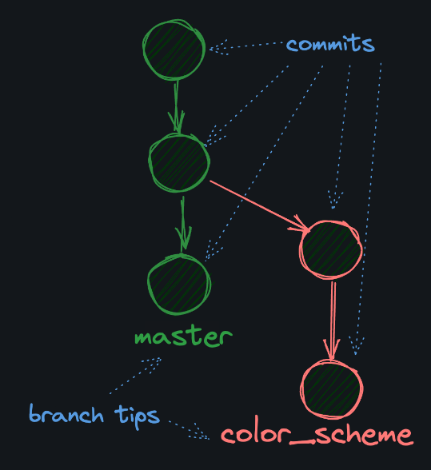

<details>
    <summary style="font-size:18px">Under the Hood</summary>
    A branch is just a named pointer to a specific commit. When you create a branch, you are creating a new pointer to a specific commit. The commit that the branch points to is called the tip of the branch.
    
    Because a branch is just a pointer to a commit, they're lightweight and "cheap" resource-wise to create. When you create 10 branches, you're not creating 10 copies of your project on your hard drive.
</details>

```bash
    git config --global init.defaultBranch main
    git branch -m oldname newname  #  Rename a Branch
    git switch -c my_new_branch # create and switch to new branch if  it doesn't already exist
```

When you create a new branch, it uses the current commit you are on as the branch base. For example, if you're on your main branch with 3 commits, A, B, and C, and then you run <code>git switch -c my_new_branch</code>, your new branch will look like this:


<details>
    <summary style="font-size:18px">Log Flags</summary>
    The first is --decorate. It can be one of:
    <ul>
      <li><code>short</code> (the default)</li>
      <li><code>full</code> (shows the full ref name)</li>
      <li><code>no</code> (no decoration)</li>
    </ul>
</details>

```bash
        git --no-pager log --decorate=full --oneline
```
The "heads" (or "tips") of branches are stored in the .git/refs/heads directory. If you cat one of the files in that directory, you should be able to see the commit hash that the branch points to.

```bash
    find  .git/refs/heads/main | xargs cat 
```