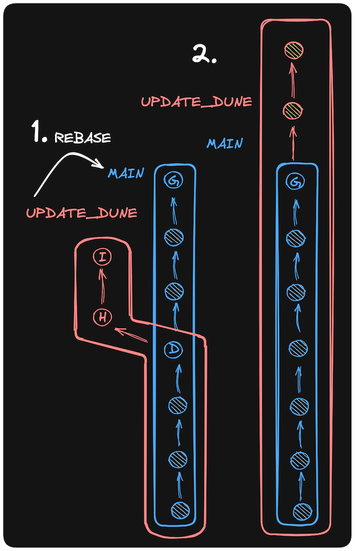

### Run Rebase

To use rebase to bring changes from <code>main</code> onto a current branch (let's pretend we're on one called <code>update_dune</code>), we would run this while on the <code>update_dune</code> branch:

```bash
    git rebase main
```

<p>This will do the following:</p>
 <ol>
    <li>Checkout the latest commit from <code>main</code> into a temporary location</li>
    <li>Replay each commit from <code>update_dune</code> one at a time onto this temporary location</li>
    <li>Update the <code>update_dune</code> branch to point to the last replayed commit in the temporary location, making this the new permanent <code>update_dune</code>.</li>
    <li>The rebase does <em>not</em> affect the <code>main</code> branch; <code>update_dune</code> now includes all changes from <code>main</code>.</li>
</ol>

While still on the <code>update_dune</code> branch, rebase your changes onto main. main is the base, and we want <code>update_dune</code>'s changes on top of it.




